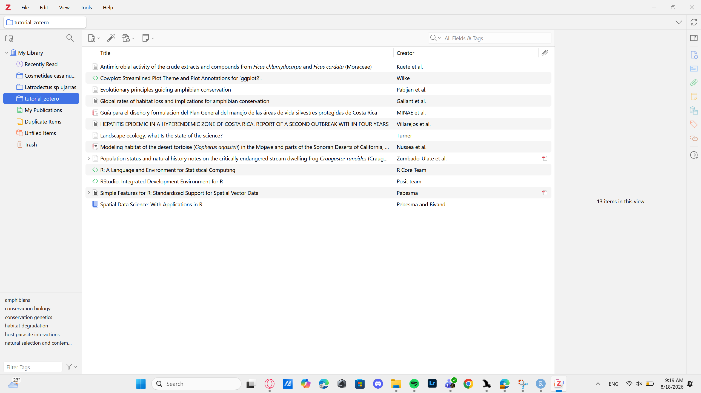

## Introducción

Esta práctica consistio en el aprendizaje de la plataforma de zotero. Se abarco desde la descarga de las aplicaciones hasta la utillización de la misma.

## Objetivo

 Al finalizar este tutorial, el estudiante será capaz de:  Crear y organizar una biblioteca bibliográfica en Zotero.  Incorporar referencias mediante DOI, archivos RIS y Zotero Connector.  Revisar y corregir los metadatos de una referencia.  Instalar y utilizar un estilo bibliográfico.  Insertar citas y bibliografías automáticamente en Microsoft Word.  Incorporar referencias que no corresponden a artículos científicos, como reportes, páginas web y software.  Citar R, RStudio y paquetes de R.

## Metodología

Por medio de un tutorial proporcionado por el profesor nos guíamos en el aprendizaje de como incorporar de manera correcta las citas en el sitio de zotero, exportnadolas directamente desde el doi, el ris o de forma manua, también a editarlas para un uso correcto de las mismasl. Así mismo aprendimos como utilizarlas dentro de un documento word y como intercambiar entre los diferents tipos de citaciones según los requerimientos de las diferentes revistas.

## Resultados

amphibian conservation [@pabijan_evolutionary_2020]

La actividad antimicrobial proviene de diferentes métodos de investigación los cuales utilizan recursos brindados por el estado para poder llevar a cabo los trabajos. [@kuete2008]

Cuadro 1. Métodos utilizados para incorporar referencias bibliográficas a Zotero.

| Método | ¿Cuándo utilizarlo? |
|------------------------------------|------------------------------------|
| DOI | Cuando la publicación tiene un DOI conocido |
| Archivo RIS | Cuando la revista o base de datos permite exportar la referencia |
| Zotero Connector | Para capturar referencias directamente desde el navegador |
| Entrada manual | Cuando la información no puede importarse automáticamente |

## Conclusiones

A manera personal, concluyo en que la implementación de este tipo de herraminetas es fundamental en la formación profesional de un biologo investigador, nos permite tener las fuentes de una manera organizada y poder utilizarlas de manera eficiente.

## Referencias
