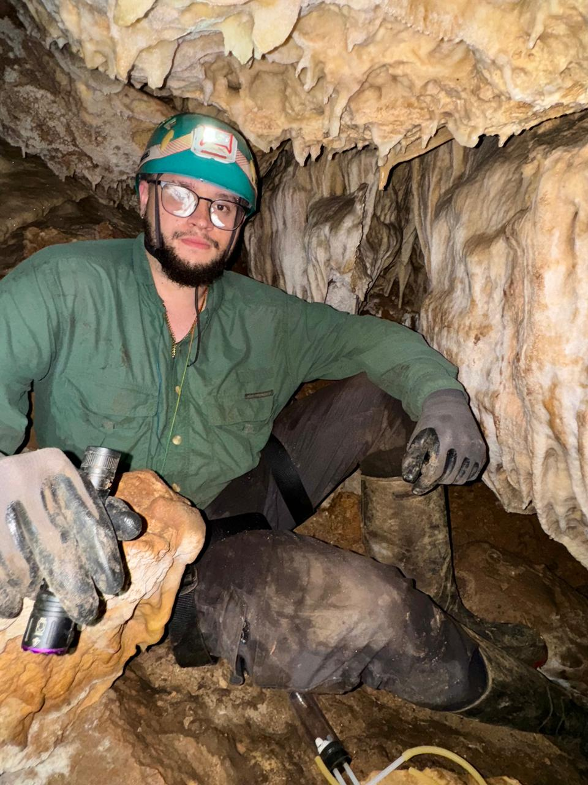

::: {.perfil-superior}

::: {.perfil-foto}

{fig-alt="Fotografía de perfil"}

:::

::: {.perfil-info}

# Nombre Apellido

## Estudiante de Bachillerato en Biología Tropical

Escuela de Ciencias Biológicas  
Universidad Nacional, Costa Rica

::: {.enlaces-perfil}

[<i class="bi bi-envelope-fill"></i> Correo](mailto:juan.hernandez.vasquez@est.una.ac.cr)

[<i class="bi bi-github"></i> GitHub](https://github.com/hernandezvasquezjp)

[<i class="bi bi-person-badge-fill"></i> ORCID](https://orcid.org/0009-0008-8184-9749)

[<i class="bi bi-linkedin"></i> LinkedIn](https://linkedin.com/in/usuario)

:::

:::

:::

---

## Biografía

Estudiante de Biología enfocado en el estudio de la aracnología, con interés en la taxonomía, ecología y conservación de arañas.---

## Áreas de interés

- Ecología
- Conservación
- Herpetología
- Ciencia de datos
- Aracnología

---

## Habilidades

- R
- Quarto
- Git y GitHub
- QGIS
- Microsoft Office

---

## Formación académica

**Universidad Nacional (UNA)**

Bachillerato en enseñanza de las ciencias naturales

Bachillerato en Biología

*2018 – Presente*
