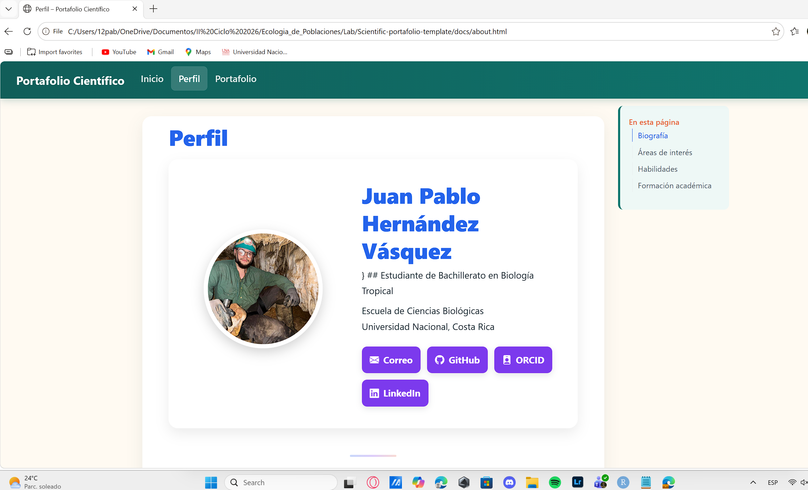

## Objetivo

Creación de un sitio web personalizado

## Materiales y herramientas

- RStudio
- Quarto
- Git
- GitHub

## Procedimiento

- Paso 1. Crear un repositorio a partir del Template Repository

<!-- -->

-  Paso 2. Clonar el repositorio en RStudio

<!-- -->

-  Paso 3. Explorar la estructura del proyecto

<!-- -->

-  Paso 4. Renderizar el sitio web por primera vez

<!-- -->

-  Paso 5. Explorar el sitio web

<!-- -->

-  Paso 6. Personalizar las imágenes del portafolio

<!-- -->

-  Paso 7. Personalizar el perfil profesional

<!-- -->

-  Paso 8. Personalizar la portada

<!-- -->

-  Paso 9. Explorar la organización del portafolio

<!-- -->

-  Paso 10. Configurar GitHub Pages

<!-- -->

-  Paso 11. Guardar y enviar los cambios desde la pestaña Git de RStudio

<!-- -->

-  Paso 12. Abrir y verificar el sitio publicado

## Resultados

Creación exitosa del sitio web

## Figuras y tablas

Figura 1. Comprobacion desitio web

## Reflexión final

Responda brevemente:

- ¿Qué aprendí?

Aprendí que en mis computadora tengo que refrescar y formatear el cache con la opción de render y ctrl f5 para poder visualizar los cambios dentro de el sitio web.

Pasos para cargar actualizaciones:

1.  Guardar cambio
2.  Presionar Render en la pestaña
3.  Utilizar en la consola el siguiente código: quarto::quarto_render()
4.  Ir a la sección de Git, hacer staged en cada archivo disponible, seleccionar commit, nombrar el cambio, commit y push

- ¿Qué dificultad encontré?

Una de las principales dificultades con la que me encontré fue familiarizarme con el ecosistema digital y todas sus extensiones, reconocer que en cada una se encuentra alguna sección del sitio web, tambien otra dificultad que va de la mano es el hecho de recordar cada paso para poder cargar y actualizar correctamente los cambios. El aspecto positivo es que estas dificultades es posible sobrepasarlas con la práctica.

- ¿Cómo podría aplicar esta herramienta o conocimiento en otro contexto?

Me parece una opción bastante interesante para generar un sitio web dirigido a un unico grupo de animales, por ejemplo arañas de CR.
